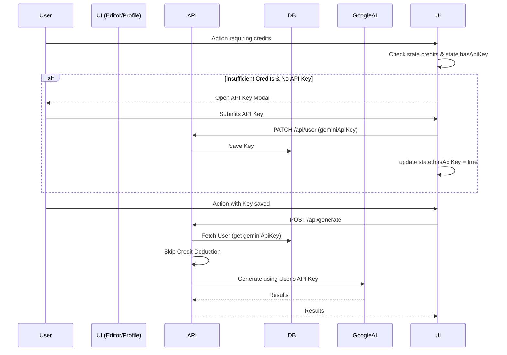

# Bring Your Own Key (BYOK) — Implementation Plan

This plan details how we will allow users to add their own Gemini API key, seamlessly prompting them when they run out of credits, and bypassing internal credit deduction when a personal key is used.

## Architecture & Flow



## Proposed Changes

### 1. Schema Updates
#### [MODIFY] `prisma/schema.prisma`
Add `geminiApiKey` to the `User` model:
```prisma
model User {
  ...
  geminiApiKey  String?  @db.Text
  ...
}
```

### 2. Backend API Updates
#### [MODIFY] `src/app/api/user/route.ts`
- **GET**: Return `hasGeminiApiKey: !!user.geminiApiKey` (never return the plaintext key to the client).
- **PATCH**: Allow updating the `geminiApiKey`. If an empty string is provided, set it to `null` to remove it.

#### [MODIFY] `src/app/api/credits/route.ts`
Update the response to return both the credit balance and the key status:
```json
{ "credits": 20, "hasApiKey": true }
```

### 3. Backend AI & Credit Services
#### [MODIFY] `src/lib/services/credits.service.ts`
Update `checkCredits` and `deductCredits` to check if the user has a `geminiApiKey`. If they do, immediately return and bypass any credit enforcement or deduction.

#### [MODIFY] `src/lib/services/ai.service.ts`
Update `createGoogleAI(userApiKey?: string | null)`:
- If `userApiKey` is provided, instantiate `@google/genai` with `{ apiKey: userApiKey }`.
- If not provided, fallback to the existing Vertex AI configuration using service account credentials.

#### [MODIFY] `src/app/api/edit-image/route.ts` & `src/app/api/generate/route.ts`
Fetch the user's `geminiApiKey` from the database and pass it to `createGoogleAI()`.

### 4. Frontend State & Services
#### [MODIFY] `src/types/editor.types.ts` & `src/store/slices/core-slice.ts`
Add `hasApiKey: boolean` to `CoreSlice`. Update `api.service.ts` to fetch and return this flag alongside credits, storing it in Zustand.

#### [MODIFY] `src/store/slices/ui-slice.ts`
Add `showApiKeyModal: boolean` state.

#### [MODIFY] `src/store/slices/ai-actions-slice.ts`
Update `checkSufficientCredits()`:
- If `state.hasApiKey` is true, immediately return `true` (bypass client-side cost check).
- If credits are insufficient, call `set({ showApiKeyModal: true })` to prompt the user seamlessly, instead of just showing a generic error.

### 5. Frontend UI
#### [NEW] `src/components/editor/modals/api-key-modal.tsx`
A modal that informs the user they are out of credits and prompts them to enter their Gemini API key (from Google AI Studio) to continue using the application for free.

#### [MODIFY] `src/app/(protected)/profile/page.tsx`
Add a "Bring Your Own Key" section under Settings where users can add, update, or remove their Gemini API key.

## Verification Plan
1. `npx prisma generate` to apply schema changes.
2. In the app, set a user's credits to 0.
3. Try an AI action -> verify the **API Key Modal** opens.
4. Input a valid Gemini API key.
5. Try the AI action again -> verify it succeeds using the provided key and 0 credits are deducted.
6. `npm run build` and `tsc --noEmit` pass with zero errors.
